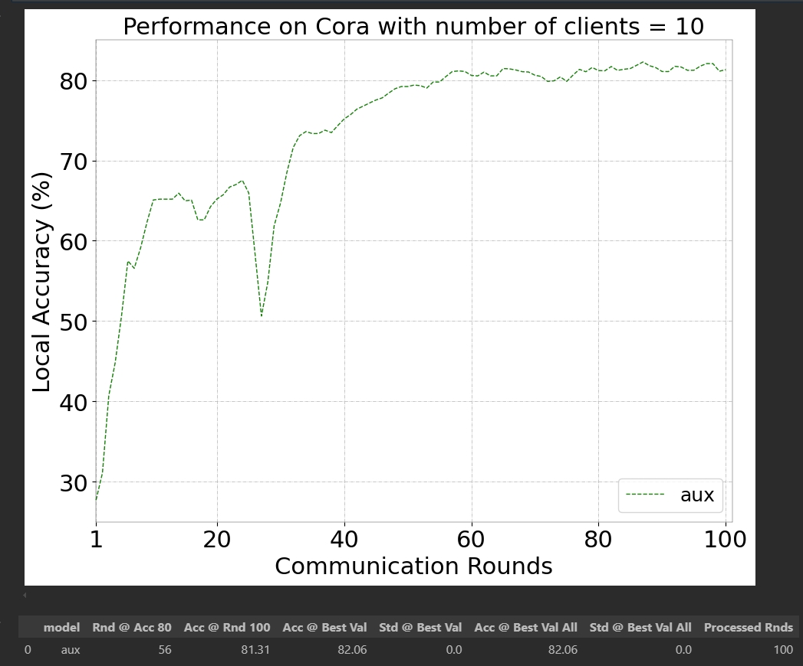

# [NeurIPS 2025] Personalized Subgraph Federated Learning via Differentiable Auxiliary Projections

## Requirement

- Python 3.9.16
- PyTorch 2.0.1
- PyTorch Geometric 2.3.0
- METIS (for data generation), https://github.com/james77777778/metis_python

**Train the model**:

```
python main.py --norm-scale 10 --n-dims 256 --dropout 0.7 --sigma 10 --model fedpub_aux
```

## Run our pretrained model to reproduce the results in the paper

Run ``analysis10.ipynb``

## Running Example



## Acknowledgement

This project draws in part from [FED-PUB](https://github.com/JinheonBaek/FED-PUB). Thanks for their great work and code!

## Citation

If you find our work useful, please cite:

```
@article{zhuo2025personalized,
  title={Personalized Subgraph Federated Learning with Differentiable Auxiliary Projections},
  author={Zhuo, Wei and Zhan, Zhaohuan and Yu, Han},
  journal={arXiv preprint arXiv:2505.23864},
  year={2025}
}
```

Feel free to contact jhuow@proton.me if you have any questions.
